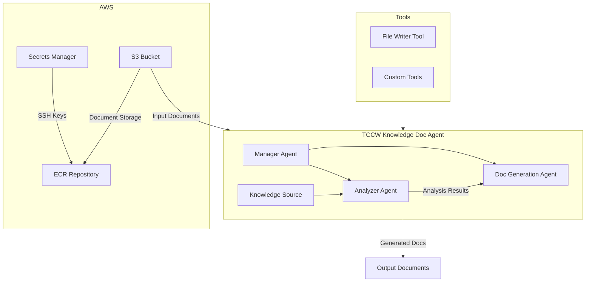

# TCCW Knowledge Document Agent

A sophisticated AI-powered document analysis and knowledge extraction system built with crewAI and AWS integration. This system processes documents stored in S3, analyzes their content, and generates comprehensive documentation using a team of specialized AI agents.

## Architecture



## Features

- **Multi-Agent System**: Utilizes specialized AI agents for different tasks:
  - Manager Agent: Orchestrates the workflow
  - Analyzer Agent: Processes and analyzes documents
  - Doc Generation Agent: Creates comprehensive documentation
- **AWS Integration**: 
  - S3 bucket integration for document storage
  - ECR for container deployment
  - Secrets Manager for secure credential management
- **Containerized Deployment**: Docker-based deployment for scalability and consistency
- **Flexible Tool System**: Extensible tool architecture for custom functionality

## Prerequisites

- Python >=3.11, <3.13
- Docker
- AWS CLI v2
- Access to AWS services (S3, ECR, Secrets Manager)

## Installation

1. Clone the repository:
```bash
git clone <repository-url>
cd tccw-knowledge-doc-agent
```

2. Install dependencies using UV (recommended):
```bash
pip install uv
uv pip install -e .
```

3. Set up environment variables:
```bash
export GITHUB_PEM_SECRET_ID="your-secret-id"
export S3_EVENT_BUCKET="your-bucket"
export S3_EVENT_KEY="your-key"
```

## Configuration

1. AWS Credentials:
   - Ensure AWS credentials are properly configured
   - Set up necessary IAM roles and permissions

2. Environment Variables:
   - Create a `.env` file based on the provided template
   - Configure all required AWS service endpoints

## Usage

### Local Development

1. Run the agent locally:
```bash
python -m tccw_knowledge_doc_agent.main
```

2. Training mode:
```bash
python -m tccw_knowledge_doc_agent.main train <iterations> <filename>
```

3. Test mode:
```bash
python -m tccw_knowledge_doc_agent.main test <iterations> <model_name>
```

### Docker Deployment

1. Build and push to ECR:
```bash
./docker.sh <task-name> <tag> <ecr-url> <ecr-full-url> <region> true
```

2. Run container:
```bash
docker run -e AWS_ACCESS_KEY_ID=<key> \
           -e AWS_SECRET_ACCESS_KEY=<secret> \
           -e S3_EVENT_BUCKET=<bucket> \
           -e S3_EVENT_KEY=<key> \
           <ecr-full-url>
```

## Development

### Project Structure
```
tccw-knowledge-doc-agent/
├── src/
│   └── tccw_knowledge_doc_agent/
│       ├── crew.py          # Core agent implementation
│       ├── main.py          # Entry point
│       └── tools/           # Custom tools
├── knowledge/              # Knowledge base
└── docker/                # Docker configuration
```

### Adding Custom Tools

1. Create a new tool in `src/tccw_knowledge_doc_agent/tools/`
2. Inherit from `BaseTool`
3. Define input schema and implementation
4. Register in the crew configuration

## CI/CD

- GitHub Actions workflow for automated builds
- Automated ECR push on main branch updates
- Build validation on pull requests

## Contributing

1. Fork the repository
2. Create a feature branch
3. Commit your changes
4. Push to the branch
5. Create a Pull Request

## License

[License Type] - See LICENSE file for details

## Author

Nestor Colt (nestor.colt@gmail.com)

## Support

For support and questions:
- Create an issue in the repository
- Contact the development team
- Refer to the documentation
